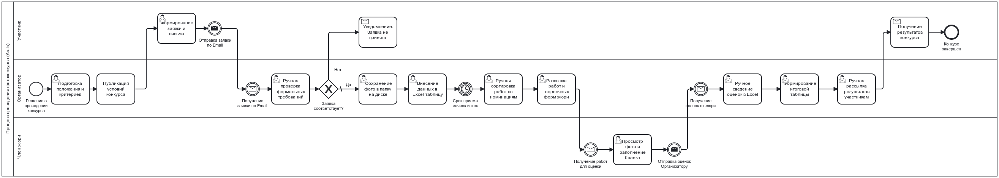
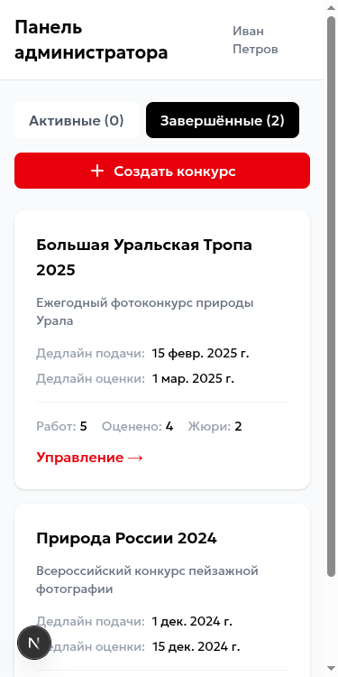
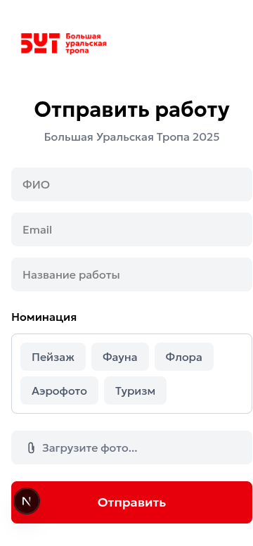
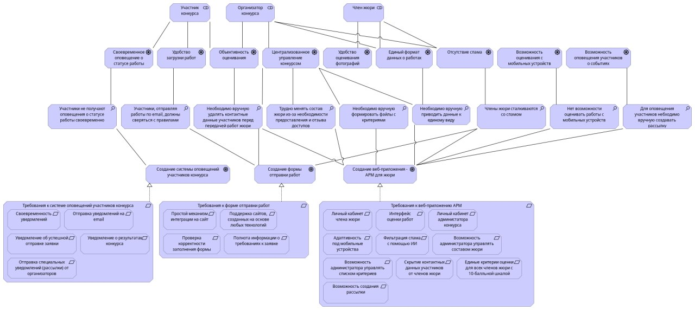
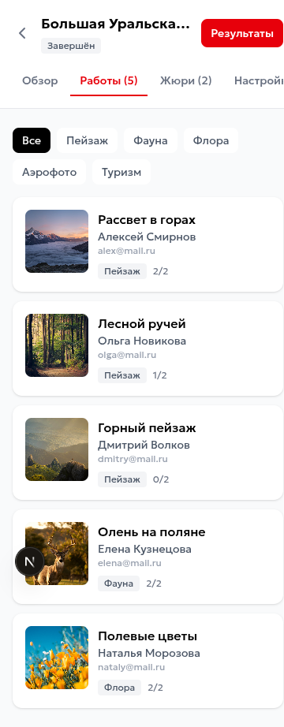

# Отчёт по прототипу информационной системы «Фотоконкурс»

## 1. Общее описание прототипа

Прототип представляет собой веб-приложение для проведения фотоконкурсов с тремя основными ролями пользователей:

- **Администратор (организатор конкурса)** — создаёт конкурсы, задаёт номинации и критерии оценки, управляет составом жюри, просматривает результаты
- **Член жюри** — оценивает работы по заданным критериям (шкала 1-10)
- **Участник конкурса** — подаёт работы через публичную форму

### Технологический стек
- **Frontend:** Next.js 15, React 19, Tailwind CSS
- **Данные:** Mock-данные (имитация API)
- **Адаптивность:** Mobile-first дизайн (375×750)

---

## 2. Соответствие BPMN-схемам

### 2.1. BPMN AS-IS (текущий процесс)

Схема AS-IS описывает ручной процесс проведения конкурса:
- Ручная проверка заявок организатором
- Сохранение фото в папку на диске
- Ведение Excel-таблицы
- Ручная рассылка работ жюри
- Ручное сведение оценок

**Прототип автоматизирует все эти процессы.**

### 2.2. BPMN TO-BE (целевой процесс)

| Процесс из схемы | Реализация в прототипе |
|------------------|------------------------|
| Создание конкурса и номинаций | ✅ Форма создания конкурса |
| Задание критериев оценки | ✅ Динамическое добавление критериев |
| Добавление членов жюри | ✅ Поиск и добавление пользователей |
| Активация приёма заявок | ✅ Через дедлайны |
| Заполнение заявки участником | ✅ Публичная форма подачи |
| Автоматическая проверка требований | ⚠️ Валидация формы (базовая) |
| Оценка работы жюри | ✅ Интерфейс оценки |
| Получение результатов | ✅ Таблица результатов |
| Автоматический подсчёт результатов | ✅ Суммирование баллов |
| Формирование пар (pairwise) | ❌ Не реализовано |
| Рассылка уведомлений | ❌ Не реализовано |

### Скриншот: Панель администратора

*Реализует: просмотр списка конкурсов (активные/завершённые), переход к управлению*

### Скриншот: Создание конкурса

*Реализует: создание конкурса с номинациями, критериями оценки, добавление жюри*

---

## 3. Соответствие ArchiMate-моделям

### 3.1. Модель бизнес-уровня

| Элемент схемы | Реализация |
|---------------|------------|
| Участник конкурса | ✅ Публичная форма подачи работ |
| Член жюри | ✅ АРМ жюри с оценкой работ |
| Организатор конкурса | ✅ Панель администратора |
| Подача конкурсной работы | ✅ `/contest/[id]/submit` |
| Оценка конкурсных работ | ✅ `/jury/[contestId]` |
| Управление конкурсом | ✅ `/admin/contests/[id]` |

### Скриншот: Форма подачи работы (участник)

*Реализует: сервис подачи работ, создание конкурсной работы*

### 3.2. Модель уровня приложений

| Компонент схемы | Реализация |
|-----------------|------------|
| Модуль управления конкурсом | ✅ CRUD конкурсов |
| АРМ Жюри | ✅ Интерфейс оценки работ |
| Модуль приёма работ | ✅ Форма и валидация |
| Сервис уведомлений | ❌ Mock |
| Модуль аутентификации | ❌ Mock (hardcoded пользователь) |
| API Загрузки Фото | ❌ Mock (Unsplash) |
| API Оценки Работ | ✅ Mock API |

### Скриншот: Интерфейс оценки работ (жюри)

*Реализует: АРМ Жюри, оценка по критериям (1-10)*

### Скриншот: Панель жюри

*Реализует: список конкурсов для оценки, переход к оценке работ*

### 3.3. Модель аппаратного уровня

| Компонент | Статус |
|-----------|--------|
| СУБД (PostgreSQL/MySQL) | ❌ Mock-данные |
| Веб-сервер (Nginx/Apache) | ⚠️ Next.js dev server |
| Сервер приложений (Backend) | ❌ Mock API |
| Хранилище файлов (S3) | ❌ Mock (Unsplash) |
| ПК / Мобильное устройство | ✅ Адаптивный интерфейс |

---

## 4. Реализация требований

### 4.1. Модель мотивации и требований

#### Требования к АРМ

| Требование | Статус | Скриншот/описание |
|------------|--------|-------------------|
| Личный кабинет члена жюри | ✅ | `/jury` — список конкурсов |
| Интерфейс оценки работ | ✅ | Шкала 1-10 по каждому критерию |
| Личный кабинет администратора | ✅ | `/admin` — управление конкурсами |
| Адаптивность под мобильные | ✅ | 375×750, sticky header |
| Управление составом жюри | ✅ | Добавление/удаление жюри |
| Скрытие контактов от жюри | ✅ | Жюри видит только название и номинацию |
| 10-балльная шкала | ✅ | Кнопки 1-10 |
| Управление критериями | ✅ | При создании конкурса |
| Экспорт результатов | ✅ | CSV экспорт |

### Скриншот: Управление конкурсом

*Реализует: обзор конкурса, статистика, ссылка для участников*

### Скриншот: Список работ

*Реализует: просмотр поданных работ, фильтрация по номинациям*

### Скриншот: Управление жюри

*Реализует: добавление/удаление членов жюри, статистика оценок*

### Скриншот: Результаты конкурса

*Реализует: таблица результатов с местами, баллами, контактами, экспорт CSV*

---

## 5. Итоговое соответствие

### Покрытие функциональности: **~75-80%**

#### ✅ Полностью реализовано:
- Весь пользовательский интерфейс для трёх ролей
- Создание и управление конкурсами
- Настройка номинаций и критериев
- Управление составом жюри
- Подача работ участниками
- Оценка работ членами жюри
- Просмотр и экспорт результатов
- Адаптивный дизайн (mobile-first)

#### ❌ Не реализовано (ожидаемо для прототипа):
- Backend API (используются mock-данные)
- Аутентификация и авторизация
- Email-уведомления
- Загрузка и хранение файлов
- Pairwise rating алгоритм

---

## 6. Структура URL

| URL | Роль | Описание |
|-----|------|----------|
| `/admin` | Администратор | Панель со списком конкурсов |
| `/admin/contests/new` | Администратор | Создание конкурса |
| `/admin/contests/[id]` | Администратор | Управление конкурсом |
| `/admin/contests/[id]/results` | Администратор | Результаты |
| `/jury` | Жюри | Панель со списком конкурсов |
| `/jury/[contestId]` | Жюри | Оценка работ |
| `/jury/[contestId]/history` | Жюри | История оценок |
| `/contest/[id]/submit` | Участник | Подача работы |

---

## 7. Заключение

Разработанный прототип полностью соответствует целевому бизнес-процессу (BPMN TO-BE) с точки зрения пользовательского интерфейса. Реализованы все основные функции, необходимые для проведения фотоконкурса:

1. **Организатор** может создать конкурс, настроить номинации и критерии, добавить жюри, просмотреть работы и результаты
2. **Жюри** может оценить работы по заданным критериям
3. **Участник** может подать работу через публичную форму

Прототип демонстрирует работоспособность всех ключевых экранов и взаимодействий, описанных в моделях ArchiMate и BPMN.

